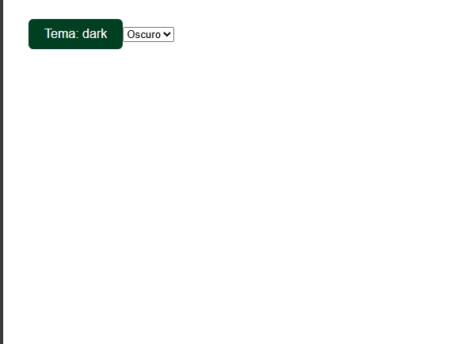
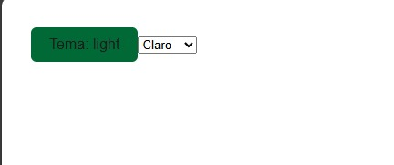

# espe-theme-toggle

Componente web Stencil que permite seleccionar tema claro u oscuro con animación suave, usando tokens de color institucional.

## Propiedades

- `initialTheme` (string): Tema inicial que puede ser `"light"` o `"dark"`. Por defecto es `"light"`.

## Estado

- `theme` (string): Estado interno que representa el tema actual. Se inicializa con `initialTheme`.

## Métodos y Ciclo de Vida

- `componentWillLoad()`: Método del ciclo de vida de Stencil que se ejecuta antes del renderizado inicial. Aquí se inicializa el estado `theme` con el valor de la propiedad `initialTheme`.

- `toggleTheme()`: Alterna el valor de `theme` entre `"light"` y `"dark"`. Se llama cuando el usuario hace click en el botón.

- `onSelectChange(event)`: Cambia el tema basado en la selección del usuario en el `<select>`. Actualiza el estado `theme` al valor seleccionado.

## Renderizado

El método `render()` devuelve el HTML del componente:

- Un botón que muestra el tema actual y cambia el tema al hacer click.
- Un selector `<select>` que permite elegir entre `"Claro"` y `"Oscuro"`.

El botón y el selector reflejan el estado actual del tema y aplican las clases CSS correspondientes para estilos visuales.

## Estilos

- Definidos en `espe-theme-toggle.css`.
- Dos temas: `.light` (verde claro) y `.dark` (verde oscuro).
- Animaciones suaves para cambios de color.

---

## Uso

```html
<espe-theme-toggle initial-theme="light"></espe-theme-toggle>
```

1. Clona este repositorio o descarga el código fuente.

```bash
git clone https://github.com/tuusuario/espe-theme-toggle.git
cd espe-theme-toggle
```
2. Instala las dependencias:

```bash
npm install
```
3. Construye el proyecto:

```bash
npm run build
```
4. Sirve los archivos con un servidor local para probar (por ejemplo con http-server):

```bash
npm install -g http-server
http-server .
```
5. Abre en el navegador:

```arduino
http://localhost:8080
```

## Estructura del proyecto
```bash
espe-theme-toggle/
├── src/
│   └── components/
│       └── espe-theme-toggle/
│           ├── espe-theme-toggle.tsx
│           └── espe-theme-toggle.css
├── build/             # Archivos generados tras build (por ejemplo espe-components.esm.js)
├── package.json
├── rollup.config.js   # Configuración del build
└── README.md
```
Incluye el componente en tu HTML importando el bundle:
```html
<script type="module" src="/build/espe-components.esm.js"></script>

<espe-theme-toggle initial-theme="light"></espe-theme-toggle>
```
## Evidencias del proyecto en ejecución
### Evidencia 1:

### Evidencia 2:

